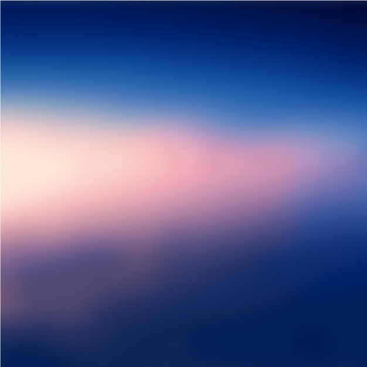
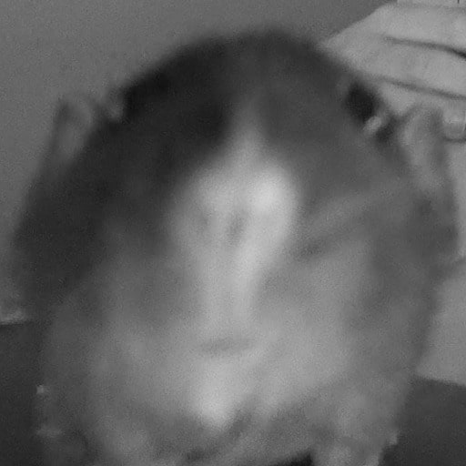
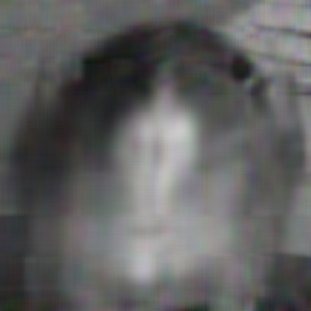
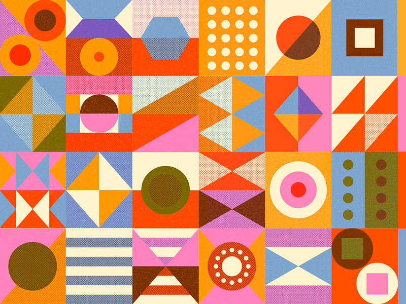
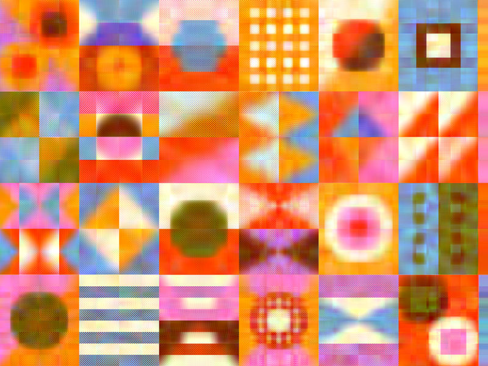
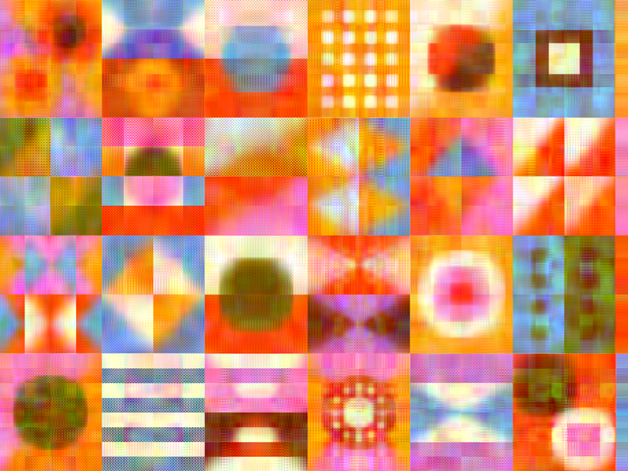
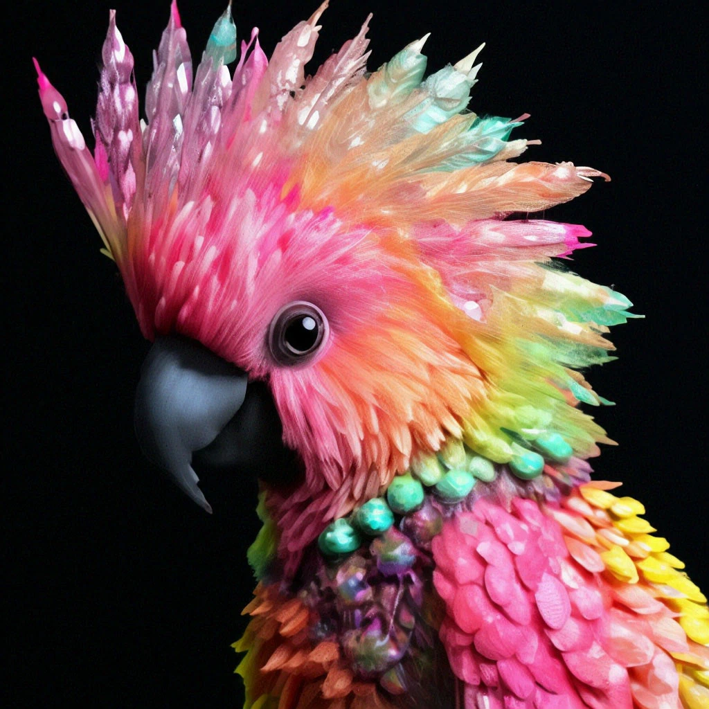
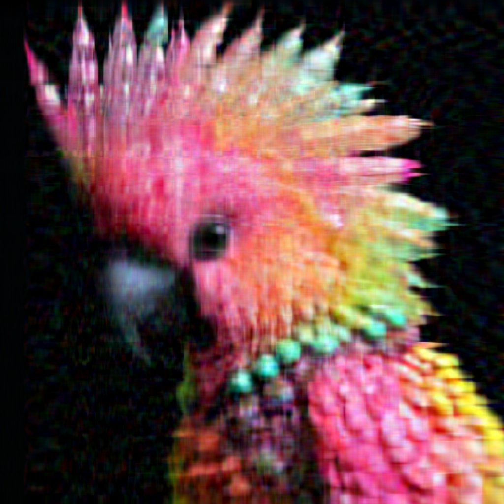

## Usage

```bash
python3 - m pip install - r requirements.txt
make
```

В функции `__init__` можно указать путь до **src bmp** и до **output directory**. По дефолту это **'src_bmp'** и
**'res_bmp'** соответственно.

## Описание

### Промежуточное представление

Промежуточное представление имплементирует класс `ImgCompressed` в файле **representaion_BMP**.
В данном классе, как и в классе `SVD` реализованы методы `to_bytes` и `from_bytes`, тем самым позволяя сохранять
сжатое изображение в файл посредством записи или чтения `bytes`

**Поля данного класса**:

- **weight** (ширина изображения)
- **height** (высота изображения)
- **k** (размер средней матрицы с разложении). При сжатии в `ratio` раз, `k` считается по формуле
    - `((image_size / ratio) - sizeof(float32)) / (len([r, g, b]) * sizeof(float32) * (width + height + 1)`
- **red** (класс `SVD` для красного цвета)
- **blue** и **green** (аналогично)

**Поля класса SVD**

- **u** (ортогональная матрица)
- **s** (диагональная матрица с диагональю из сингулярных чисел)
- **vt** (ортогональная транспонированная матрица)

### Компрессоры

- `NumpySVDCompressor` - класс, реализующий сингулярное разложение при помощи методов библиотеки Numpy
- `PowerSVDCompressor` - класс, реализующий степенной метод (для подробного ознакомления пройдите
  по [ссылке](http://www.cs.yale.edu/homes/el327/datamining2013aFiles/07_singular_value_decomposition.pdf))
- `BlockPowerSVDCompressor` - класс, реализующий блочный степенной
  метод ([тык](https://www.degruyter.com/document/doi/10.1515/jisys-2018-0034/html#j_jisys-2018-0034_fig_004))

## Эксперимент

### Характеристики вычислительной машины

- Процессор — AMD Ryzen 5 5500U 2.1 GHz
- Оперативная память — 16 Gb 3200 MHz
- Операционная система — Ubuntu 22.04.4 LTS

Для каждого изображение `ratio`(сжатие) было равно **5**.

Для честности эксперимента методам разложения из классов `PowerSVDCompressor` и `BlockPowerSVDCompressor` выделено такое
же время, какое тратит `NumpySVDCompressor`, то есть предоставлено одинаковое время работы каждому алгоритму.

### Градиент

Для начала попробуем сжать "градиентную" фотографию, чтобы посмотреть на то, как алгоритмы справляются с плавным
переходом цветов.

| Оригинал                                           | Numpy                                                      | Power                                                      | Block power                                                     |
|----------------------------------------------------|------------------------------------------------------------|------------------------------------------------------------|-----------------------------------------------------------------|
|  |  |  |  |

Как видим, все алгоритмы получили очень хороший результат и идентичны __(или почти)__ с оригинальным изображением.
С плавным переходом цветом алгоритмы справляются отлично!

### Черно-белая фотография

Теперь рассмотрим, как справляются алгоритмы, если цвета в палитре ограничены только чёрным и белым на примере
фотографии домашней добрятской крысы - Кента.

| Оригинал                                                  | Numpy                                                             | Power                                                             | Block power                                                            |
|-----------------------------------------------------------|-------------------------------------------------------------------|-------------------------------------------------------------------|------------------------------------------------------------------------|
|  |  |  |  |

Алгоритмы опять же справились хорошо, но алгоритм `Power` справился чуть хуже и оставил немного цветных
артефактов на исходной чёрно-белой фотографии.

### Геометрические фигуры

Теперь попробуем сжать геометрические фигуры, в которых происходит резкая смена цветов. До эксперимента можно выдвинуть
гипотезу о том, что ни один алгоритм не сможет точно справиться с резкими переходами и границы фигур будут слабо
отличимыми.

| Оригинал                                                | Numpy                                                           | Power                                                           | Block power                                                          |
|---------------------------------------------------------|-----------------------------------------------------------------|-----------------------------------------------------------------|----------------------------------------------------------------------|
|  |  |  |  |

Гипотеза подтвердилась, круги в правой части фотографии слились во что-то целостное. Однако алгоритмы `Numpy`
и `Block power` справились чуть лучше. Можно заметить, что алгоритм `Power` почти полностью перекрасил некоторые круги
при восстановлении.

### Контрастная фотография

В конце эксперимента посмотрим и ещё раз убедимся, что резкую смену цвета алгоритмы сжатия, к сожалению, передают очень
плохо и качество изображения сильно ухудшается.

| Оригинал                                              | Numpy                                                         | Power                                                         | Block power                                                        |
|-------------------------------------------------------|---------------------------------------------------------------|---------------------------------------------------------------|--------------------------------------------------------------------|
|  |  |  |  |

Изображение обладало большим набором цветов и высоким разрешением, качество картинки сильно ухудшилось, однако в каждом
из полученных результатов можно всё ещё узнать отражение Какаду. Алгоритмы `Numpy` и `Block power` опять справились чуть
лучше, заметно по крылу и глазу попугая.

## Вывод

- Все три алгоритма отлично справляются с плавным переходом цветов и качество изображения почти не теряется.
- У всех алгоритмов есть проблема со сжатием контрастных и резких линий. Геометрические фигуры становятся слабо
  различимы, а цвета при восстановлении могут меняться.
- На всех экспериментах кроме градиента, можно было явно выделить фаворитов `Numpy` и `Block power` - они давали
  наилучшие и почти идентичные друг другу результаты при одинаковом времени работы.
